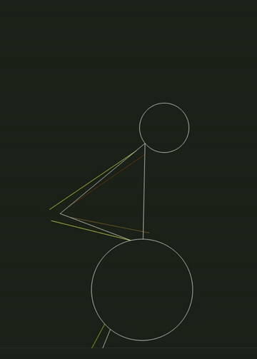
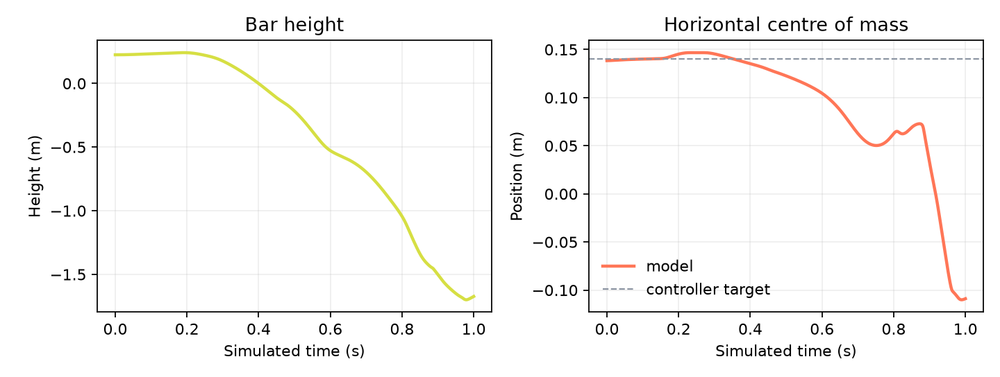

# DeadliftDynamics

**Constrained feedback control of a nonlinear articulated system, implemented from first principles.**

<p align="center">
  
</p>

The deadlift provides a concrete control problem: choose five bounded actuator intensities that raise the bar while keeping a four-link planar system horizontally stable.

No physics engine or automatic-differentiation framework is used. The equations of motion, numerical solver, controller and visualisation are implemented directly in Python and NumPy.

## 1. Mechanical model

The body is represented by four rigid segments with angles

$$
\theta_k=(\theta_{0,k},\theta_{1,k},\theta_{2,k},\theta_{3,k})^\top.
$$

For segment $i$, of length $r_i$, mass $m_i$, centre of mass $G_i$ and moment of inertia

$$
J_i=\frac{m_i r_i^2}{12},
$$

the balance of forces and moments gives

$$
m_i\vec a_{G_i/R}=\vec P_i+\vec R_i-\vec R_{i+1}+\vec f_{i,\mathrm{int}},
$$

$$
J_i\ddot\theta_i
=
M_{G_i}(\vec R_i)-M_{G_i}(\vec R_{i+1})+C_i(e).
$$

The actuator intensities follow the notation used in the original presentation:

$$
e=(e_1,e_2,e_3,e_4,e_5)^\top\in B=[0,1]^5.
$$

## 2. Finite-difference dynamics

The implementation uses the time step

$$
t=10^{-3}\ \mathrm{s}.
$$

The angular derivatives are approximated by

$$
\dot\theta_{i,k}=\frac{\theta_{i,k}-\theta_{i,k-1}}{t},
\qquad
\ddot\theta_{i,k+1}
=
\frac{\theta_{i,k+1}-2\theta_{i,k}+\theta_{i,k-1}}{t^2}.
$$

The geometry is frozen over one time step:

$$
\cos(\theta_{i,k+1})\approx\cos(\theta_{i,k}),
\qquad
\sin(\theta_{i,k+1})\approx\sin(\theta_{i,k}).
$$

This converts the nonlinear equations into a $12\times12$ linear system:

$$
A(\theta_k)X_{k+1}=B(\theta_k,\theta_{k-1},e_k),
$$

$$
X_{k+1}
=
\begin{pmatrix}
\theta_{k+1}\\
R_{x,k+1}\\
R_{y,k+1}
\end{pmatrix}
\in\mathbb R^{12}.
$$

The system is solved with `numpy.linalg.solve`; no matrix inverse is formed explicitly.

## 3. Internal forces

Each actuator joins two attachment points. For endpoints $p_j^{(0)}$ and $p_j^{(1)}$, maximum force $F_j^{\max}$ and intensity $e_j$,

$$
u_j
=
\frac{p_j^{(1)}-p_j^{(0)}}{\|p_j^{(1)}-p_j^{(0)}\|},
\qquad
\vec F_j=e_jF_j^{\max}u_j.
$$

Its torque on a segment is

$$
C_j=(p_j-G_i)\times\vec F_j.
$$

## 4. Function to optimise

Following the presentation, $Q:B\to\mathbb R$ rewards shoulder height and penalises horizontal instability:

$$
Q(e)
=
a_1(y_{\mathrm{shoulder}}-0.8)
-a_2(G_x-0.14)^2
-a_3\dot G_x^2
-a_4g
-a_5\left(\frac{\Delta(a_4g)}{t}\right)^2,
$$

with the values used by the code

$$
a_1=\frac{50}{t},\qquad
a_2=10^7,\qquad
a_3=10^3,\qquad
a_4=10^5,\qquad
a_5=2\times10^{-6}.
$$

The alignment term implemented in the repository is

$$
g
=
(x_{\mathrm{knee}}-x_{\mathrm{hand}})^2
+(x_{\mathrm{knee}}-x_{\mathrm{shoulder}})^2
+(x_{\mathrm{shoulder}}-x_{\mathrm{hand}})^2.
$$

The terms in $Q$ have different physical units. The coefficients $a_1,\ldots,a_5$ are empirical weights that place the competing objectives on useful numerical scales; $Q$ is a control score, not a physical energy.

The controller is written as a minimisation problem:

$$
L(e)=-Q(e),
\qquad
\min_{e\in B}L(e).
$$

## 5. Projected gradient descent

For each coordinate $i$, the code estimates $\partial_iL$ with two perturbed simulations. Inside $B$ it uses the centred difference

$$
\widehat{\partial_iL}(e)
=
\frac{L(e+\delta\mathbf e_i)-L(e-\delta\mathbf e_i)}{2\delta},
\qquad
\delta=10^{-3}.
$$

At the boundary of $B$, the infeasible perturbation is replaced by $e_i=0$ or $e_i=1$, giving the corresponding one-sided difference. Every perturbation runs on an independent copy containing the three latest angles, two latest centres of mass and latest value of $Q$ required by the finite differences.

The control update is

$$
e_{n+1}
=
\Pi_B\!\left(e_n-k\gamma^n\widehat{\nabla L}(e_n)\right),
$$

with

$$
k=\frac{10^{-3}}{t},
\qquad
\gamma=0.7.
$$

The inner iterations stop when

$$
\|e_{n+1}-e_n\|_\infty<\varepsilon,
\qquad
\varepsilon=10^{-3},
$$

or fail after 100 iterations. This criterion only states that the projected update has become small; it does not prove convergence to an optimum.

The controller optimises the next simulated state at every time step. It is therefore a local, one-step feedback controller, not a global trajectory optimiser.

## 6. Reference trajectory



For the existing 1,000-step reference run,

$$
T=1.000\ \mathrm{s},
\qquad
y_{\mathrm{bar}}(0)=0.225\ \mathrm{m},
\qquad
y_{\mathrm{bar}}(T)=0.646\ \mathrm{m},
$$

$$
\max_k|G_x(k)-0.14|=1.88\times10^{-2}\ \mathrm{m}.
$$

These are numerical outputs of the chosen parameterisation, not empirical measurements or evidence of an optimal lifting technique. The trajectory becomes unstable beyond the documented interval and does not demonstrate a complete lift.

## 7. Run the experiment

With [`uv`](https://docs.astral.sh/uv/), one command creates the environment, installs the dependencies and runs the reference simulation:

```bash
uv run python src/demo.py
```

The interactive visualisation is launched with:

```bash
uv run python src/main.py
```

Without `uv`, install `requirements.txt` in a virtual environment and run the same Python commands.

## 8. Implementation map

| Mathematical component | Implementation |
| --- | --- |
| Explicit simulation state and construction | [`src/state.py`](src/state.py) |
| Kinematics and actuator geometry | [`src/bone.py`](src/bone.py) |
| $A(\theta_k)$ and $B(\theta_k,\theta_{k-1},e_k)$ | [`src/matrix.py`](src/matrix.py) |
| Linear solve and state propagation | [`src/update.py`](src/update.py) |
| $Q$, $L=-Q$, $\widehat{\nabla L}$ and projected descent | [`src/brain.py`](src/brain.py) |
| Reproducible reference trajectory | [`src/demo.py`](src/demo.py) |

For a short review, follow

$$
\texttt{state.py}
\longrightarrow
\texttt{matrix.py}
\longrightarrow
\texttt{update.py}
\longrightarrow
\texttt{brain.py}.
$$

## 9. Scope and limitations

The model uses four uniform rods, five idealised actuators, approximate anthropometric parameters and a nominal 175 kg load folded into the terminal segment.

It omits three-dimensional motion, joint limits, activation dynamics, fatigue, collision handling, passive tissues and a detailed foot-ground contact model. It has not been calibrated against motion-capture or force-plate data.
